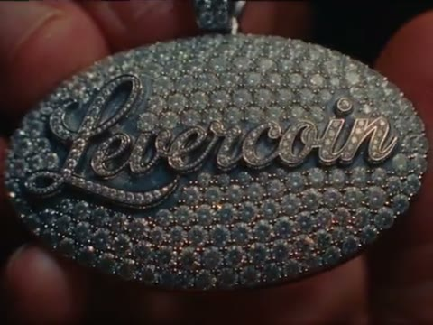

<p align="center">
  <a href="https://www.levercoin.lol">
    
  </a>
</p>

<p align="center">
  <strong>Launch a token from Claude, ChatGPT or Grok.</strong><br />
  Your wallet signs every transaction. The server never holds the key.
</p>

<p align="center">
  <a href="https://labs.levercoin.lol/status"></a>
  <a href="https://labs.levercoin.lol/status"></a>
  <a href="https://labs.levercoin.lol/status"></a>
  <a href="https://github.com/koynlabs/labs-mcp/actions/workflows/ci.yml"></a>
</p>

<p align="center">
  <a href="https://labs.levercoin.lol/mcp"></a>
  <a href="https://github.com/koynlabs/labs-mcp/commits/main"></a>
  <a href="https://github.com/koynlabs/labs-mcp/deployments/Production"></a>
  <a href="https://solana.com"></a>
  <a href="LICENSE"></a>
</p>

<p align="center">
  <sub>
    Production is <code>main</code>, deployed by Vercel. The top row reads
    <a href="https://labs.levercoin.lol/api/status">labs.levercoin.lol/api/status</a>,
    so the commit it shows is the one answering requests right now — match it to
    <a href="https://labs.levercoin.lol/mcp"><code>serverInfo.version</code></a>
    and to a commit in this repo.
  </sub>
</p>

<p align="center">
  <a href="https://www.levercoin.lol">Website</a>
  ·
  <a href="https://labs.levercoin.lol">labs</a>
  ·
  <a href="https://labs.levercoin.lol/mcp">MCP</a>
  ·
  <a href="https://x.com/LeverCoinonsol">X</a>
  ·
  <a href="https://t.me/LeverCoinonsol">Telegram</a>
  ·
  <a href="https://www.stonkfun.xyz/token/GJx6KxLzEeB5cQh7Bmo85M2N6s6bVM63VEUjT2tfe6mg">Buy on StonkFun</a>
</p>

---

<p align="center">
  <a href="https://www.levercoin.lol/tapes/levercoin-3.mp4">
    
  </a>
</p>

<p align="center">
  <a href="https://www.levercoin.lol/tapes/levercoin-3.mp4">▶ Watch the tape</a>
  &nbsp;·&nbsp;
  <a href="https://labs.levercoin.lol/demo/">▶ Play the Grok bot Rive</a>
</p>

<p align="center">
  <a href="https://labs.levercoin.lol">
    
  </a>
</p>

## Why people use it

| | |
| --- | --- |
| 🔑 **Your keys stay yours** | Every create and buy is built unsigned. You sign in Phantom. labs cannot move the funds. |
| ⚡ **One atomic bundle** | The create and the opening buys land together on Jito, or none of it does. |
| 🪙 **No launch fee** | labs does not add a treasury payment. You pay the network, and any buy you include. |
| 🤖 **Talk to it** | No dashboard to learn. Ask your assistant for a launch. It hands back a signing link. |
| 🕳️ **No subscription** | Nothing to provision per user. The creator's signature is the authorisation. |

## Connect in 30 seconds

```
https://labs.levercoin.lol/mcp
```

Streamable HTTP. No API key.

- **Claude** — Settings → Connectors → Add custom connector
- **ChatGPT** — Settings → Connectors → Advanced → Add
- **Grok** — add it as a custom MCP server

Then: *“Launch a token on pump.fun called …”*

## Tools

| Tool | What it does |
| --- | --- |
| `launch_token` | Builds a launch and returns a signing link |
| `launch_status` | Who still has to sign, and whether the bundle landed |
| `token_info` | Price, market cap, graduation progress |
| `wallet_balance` | SOL balance, to size a launch before signing |
| `stonks_pairs` | Quote tokens a StonkFun launch can pair against |
| `start_maker` | Opens a two-sided quoting session |
| `maker_status` | Position, last bid and ask, fills, time left |
| `stop_maker` | Ends a session, needs the maker wallet's signature |
| `trade_board` | StonkFun listings, with sort, search, page, and pair category |
| `perp_markets` | SOL, ETH, and BTC mark and 24h change |
| `perp_positions` | A wallet's open perps and working limits |
| `trade_swap` | Market buy or sell of a mint against SOL, returns a signing link |
| `trade_order` | Limit, stop, take-profit/stop, or DCA, returns a signing link |
| `perp_open` | Long or short SOL, ETH, or BTC, returns a signing link |
| `perp_close` | Closes one perp position back to USDC |
| `perp_exit` | Sets or cancels a take profit, stop, or limit |

## How a launch works

`launch_token` builds the create and up to three extra buys, and stores them unsigned:

| # | Transaction |
| --- | --- |
| 0 | Create the token, plus the creator's own opening buy |
| 1–3 | One buy per additional wallet the creator controls |

They go out as a single Jito bundle, which lands all-or-none. A Jito bundle holds
five transactions, and launches stay capped at three extra buyers.

You open `/sign/<bundleId>`, connect each wallet in turn, and sign. The server
re-verifies every signature against the exact message it handed out, and only
then submits. A signer can refuse, but cannot rewrite what they were given.

### The two venues

**pump.fun** goes through [PumpPortal's](https://pumpportal.fun/creation)
`trade-local`, which returns a compiled create and one compiled buy per wallet.

**StonkFun** has no launch endpoint — `paidLaunchesEnabled` is off, and
`launchLabEnabled` is on. So labs builds the Raydium LaunchLab
`initialize_with_token_2022` itself against StonkFun's platform id, and StonkFun
adopts the pool about a minute later. Standard mode only: a reward-mode launch
writes a transfer-fee extension whose withheld tax cannot be recovered if the
pool is never adopted. Call `stonks_pairs` first — a StonkFun token trades
against another token, not necessarily SOL.

### Metadata

pump.fun's `/api/ipfs` no longer accepts uploads and answers server-side
requests with a block page, so metadata is resolved one of three ways:

1. a `metadataUri` you pass in, used as-is;
2. pinned to IPFS via Pinata, if `LABS_PINATA_JWT` is set — **use this in
   production**;
3. otherwise served by labs at `/api/metadata/<id>`, which only lasts as long as
   this deployment does.

The URI is written into the token permanently, so option 3 returns a warning, and
labs refuses the launch if it cannot fetch its own URI back — that catches a
misconfigured `LABS_SITE_URL` before a token is minted pointing at nothing.

## The quoter

Off unless `LABS_MAKER_ENABLED=true`.

One disclosed wallet holds a bid and an ask around its own fair-value anchor. It
buys when the price falls through the bid, sells when it rises through the ask,
and does nothing in between — so the band has to be crossed before anything
trades. Spread is floored at 50 bps, refresh at 15 seconds, duration at 24 hours.
Inventory caps shrink size on whichever side the wallet is already heavy and stop
that side at the cap.

It runs as a Vercel Workflow: one `"use step"` quote pass, then a durable
`sleep`, so a 24-hour session costs nothing while it waits and survives a deploy.
The workflow function itself touches no Node modules — it only orchestrates.

The maker approves a session in the browser. A throwaway quoting key is generated
there, the wallet signs a plain-text approval naming the exact mint, spread and
SOL cap, and only that key reaches the server, encrypted with `LABS_SESSION_SECRET`.
It expires, and `stop_maker` discards it early.

## Running it

```bash
npm install
cp .env.example .env.local
npm run dev
npx workflow web             # inspect quoter runs
```

`LABS_SITE_URL` must be the public URL in production; it is baked into signing
links and into metadata URIs. Launch bundles fall back to in-memory storage
without Redis, which is fine for `next dev`, but maker sessions refuse to start
without it because each workflow step resumes in a new invocation.

Deploy to Vercel as its own project with its own env; it shares nothing with the
levercoin marketing site.

## Checking what is live

Production is `main` only, and `main` takes pull requests: direct pushes are
rejected, and every PR runs `typecheck` and `next build`.

Three surfaces report the same commit, so nobody has to trust the badges:

| Where | What it says |
| --- | --- |
| [`/status`](https://labs.levercoin.lol/status) | version, commit, tool count, whether Redis is backing launches, whether the quoter is on |
| [`/api/status`](https://labs.levercoin.lol/api/status) | the same values as JSON, `no-store` |
| [`/mcp`](https://labs.levercoin.lol/mcp) | `serverInfo.version` is `1.0.0+<shortsha>` on `initialize` |

```bash
curl -s https://labs.levercoin.lol/api/status | jq '{version, sha, store}'
```

Take the `sha` and open `https://github.com/koynlabs/labs-mcp/commit/<sha>`. If
it resolves to a commit on `main`, the deployment is this source.

Status is read from the running process — the build's commit and the env it
booted with. It is deliberately not an HTTP probe of `/mcp`: that would pay a
cold start on the heaviest route in the app every time a badge refreshed.

The Grok bot Rive lives at [`public/demo`](public/demo) and is served at
[`/demo`](https://labs.levercoin.lol/demo/) after deploy.

## Known limits

- Three extra buyer wallets per launch.
- StonkFun launches are standard mode only.
- The quoter supports pump.fun only. StonkFun quoting is refused rather than
  guessed at, because an existing LaunchLab pool's state is not in the
  launch-time pricing response.
- PumpPortal rejects a bundle if it dislikes any one wallet and does not say
  which, so `launch_token` lists the buyers back in that error.

## License

[MIT](LICENSE). The code is public so you can verify that a launch is signed by
your wallet and that the server never holds that key. Secrets (`LABS_PINATA_JWT`,
`LABS_SESSION_SECRET`, Redis) stay in the deployment env and
are not in this repo.
